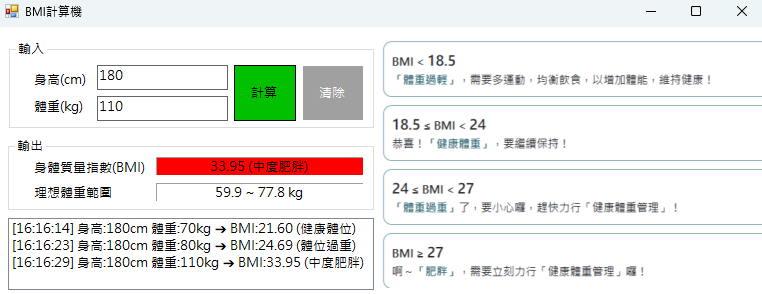

# 視窗程式設計 (II) - 上課練習(1)：BMI 計算機

**作者：** 藍奕 (1131437)

## 📖 專案簡介
這是一個使用 C# Windows Forms 開發的現代化 BMI 計算機。本專案除了具備基本的 BMI 數值計算功能，還能根據衛福部公布之成人健康體位標準，自動判定使用者的體位狀態，並透過直覺的介面與顏色提供視覺化回饋。專案同時著重於「使用者體驗 (UX)」與「無滑鼠操作」，提供流暢的輸入流程。

## ✨ 功能特色
* **精準計算與視覺回饋**：輸入身高與體重後，自動計算 BMI，並透過不同背景顏色（如健康綠、警示紅）顯示對應的體位狀態。
* **無彈窗防呆機制**：捨棄傳統的 `MessageBox`，當輸入非數字、負數或零時，直接於畫面結果區以高亮顏色顯示錯誤提示，減少不必要的滑鼠點擊。
* **無滑鼠全鍵盤操作**：
  * 完美設定 `Tab` 鍵順序，輸入完身高後可直接跳至體重。
  * 支援熱鍵操作：按下 `Enter` 鍵直接執行「計算」，按下 `Esc` 鍵執行「清除」並將焦點跳回身高輸入框。
* **輔助功能**：
  * **理想體重反推**：自動依照輸入之身高，推算並顯示符合健康體位 (BMI 18.5 ~ 24) 的理想體重範圍。
  * **歷史紀錄追蹤**：於畫面左下方提供附有時間戳記的歷史紀錄列表，方便比較多次的計算結果（且已將其排除於 Tab 鍵順序之外，確保輸入流暢）。
  * **介面美化**：整合衛福部官方參考圖表，並採用現代化明亮色系排版。

## 🚀 執行說明
1. 於「輸入區」的文字方塊中，分別輸入您的**身高 (cm)** 與 **體重 (kg)**。
2. 點擊綠色的 **「計算」** 按鈕，或直接按下鍵盤的 **`Enter`** 鍵。
3. 畫面左下方「輸出區」將即時顯示您的 BMI 數值、體位狀態，以及專屬的理想體重範圍。
4. 每次成功的計算都會加上時間標記，自動記錄於左下方的歷史紀錄清單中。
5. 若需重新計算，可點擊灰色的 **「清除」** 按鈕，或按下鍵盤的 **`Esc`** 鍵，系統將清空所有欄位與紀錄，並自動將輸入游標定位回身高欄位。

## 📸 執行畫面

